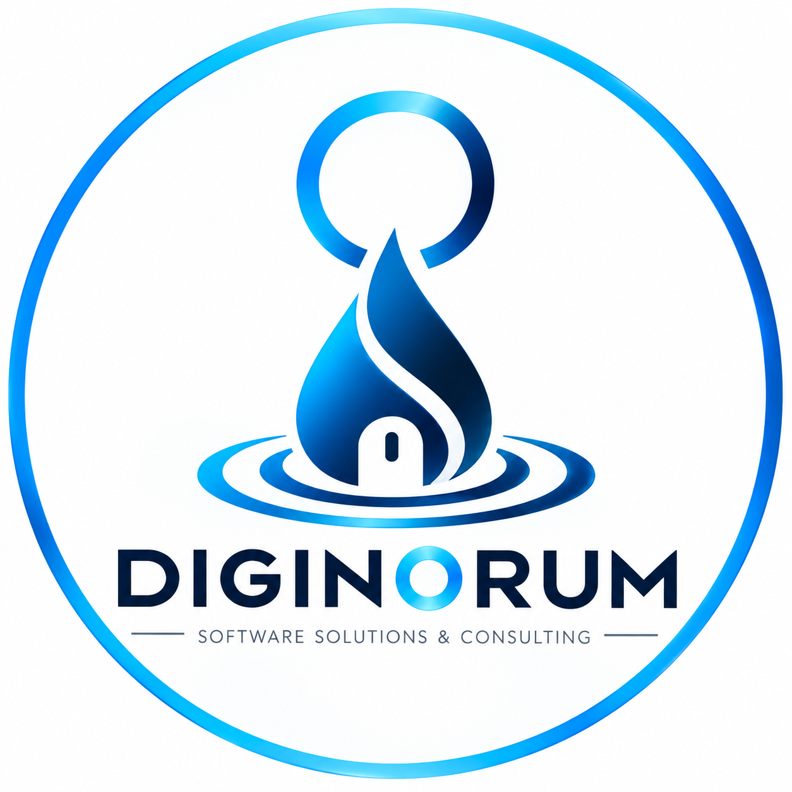

<picture>
  <source media="(prefers-color-scheme: dark)" srcset="../assets/diginorum-logo-dark.png">
  <source media="(prefers-color-scheme: light)" srcset="../assets/diginorum-logo-light.png">
  
</picture>

# DIGINORUM

### Software Solutions & Consulting

**Technology · Integration · Trust**

Building scalable software solutions for a connected world.

[Website](https://diginorum.net) · [LinkedIn](https://www.linkedin.com/company/diginorum)

---

## About Diginorum

Diginorum designs and develops software solutions focused on helping organizations transform processes, integrate systems and build scalable digital platforms.

We combine software development, system integration and infrastructure to create solutions designed around real business needs.

## What We Build

- Custom Software Development
- SaaS Platforms
- Web Applications
- APIs & System Integration
- Cloud Solutions & Infrastructure
- Database Solutions
- Business Analytics
- IT Consulting

## Technology

**Backend**  
Java · Spring Boot · REST APIs

**Frontend**  
Angular · TypeScript · HTML · CSS

**Data**  
PostgreSQL · SQL

**Infrastructure & DevOps**  
Linux · Docker · Git · CI/CD · Cloud Infrastructure

---

## Our Approach

**Develop · Integrate · Evolve**

We build technology with a focus on scalability, maintainability, integration and long-term evolution.

---

### Technology · Integration · Trust

**Diginorum**

Software solutions for a connected world.

[diginorum.net](https://diginorum.net)

